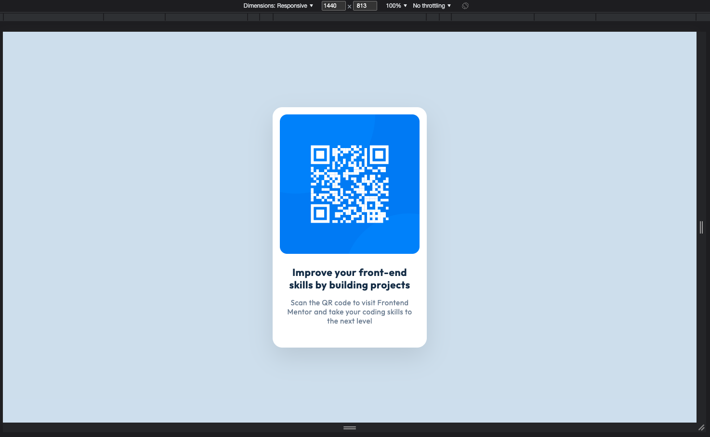

# Frontend Mentor - QR code component solution

This is a solution to the [QR code component challenge on Frontend Mentor](https://www.frontendmentor.io/challenges/qr-code-component-iux_sIO_H).

## Table of contents

- [Overview](#overview)
  - [Screenshot](#screenshot)
  - [Links](#links)
  - [Built with](#built-with)
  - [What I learned](#what-i-learned)
  - [Useful resources](#useful-resources)
- [Author](#author)

## Overview

A webpage who provdes a QR code component supporting Frontend Mentor Challenges. The project includes both Desktop and Mobile versions.

### Screenshot

### Links

- Solution URL: [Add solution URL here](https://github.com/AlinaAlexandraVizireanu/qr-code-component-main)
- Live Site URL: [Add live site URL here](https://alinaalexandravizireanu.github.io/qr-code-component-main/)

### Built with

- Semantic HTML5 markup
- CSS custom propertiesmM
- Flexbox

### What I learned

In the process of building the project I've recap Flexbox notions.

### Useful resources

- [Flexbox cheatsheet](https://flexbox.malven.co/) - This helped me for position the main container according to design needs. I'd recommend it to anyone still learning this concept.

## Author

- Website - [Alina Alexandra Vizireanu](https://alinaalexandravizireanu.github.io/qr-code-component-main/)
- Frontend Mentor - [@AlinaAlexandraVizireanu](https://www.frontendmentor.io/profile/AlinaAlexandraVizireanu)
